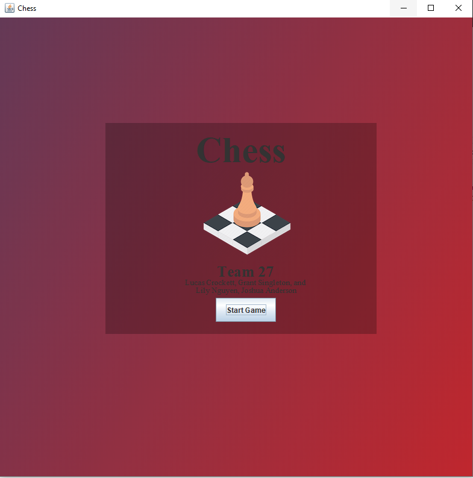
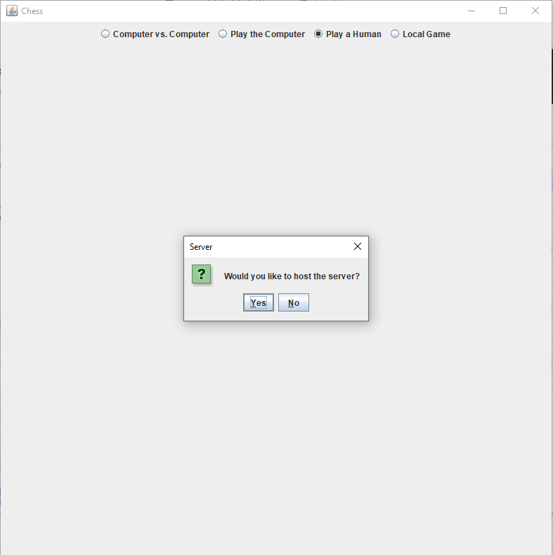
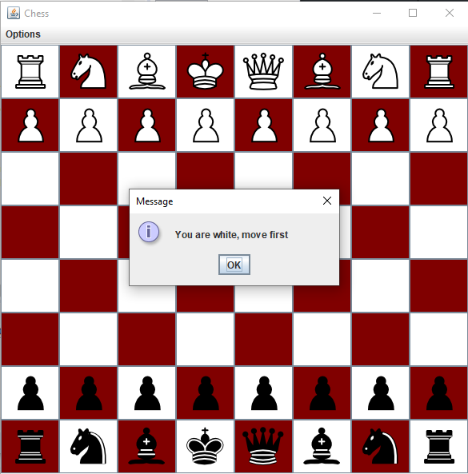
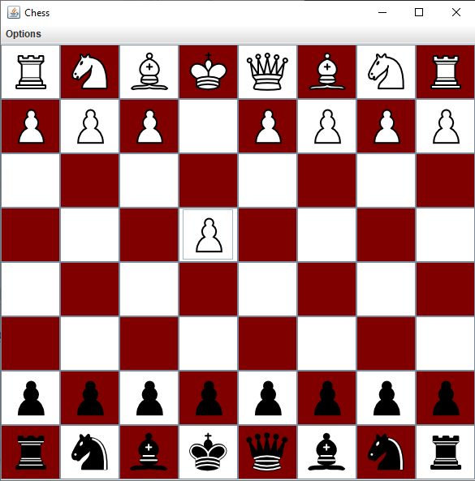

## Description
This is a fully functional chess game that can be played over a network between two humans, a human and a computer, or computer vs. computer. It can also be played locally. It is written in Java. Java Swing is used as the graphics package for the GUI build. Java Sockets are used for client-server communication which enables the game to be played over a network. This game was developed by a team of 4 students using the Agile development process. The team consisted of myself, Joshua Anderson, Lily Nguyen, and Lucas Crockett. I built the GUI, move logic, and the client-server model. Lucas wrote the move validation functions and pawn upgrades, as well as performing final debugging and testing. Lily designed the menu, and performed final testing, and Joshua programmed the AI.

## Tools
* Java Swing 
* Object Oriented Programming 
  * Inheritance
  * Polymorphism
* Agile Software Development Process

## Walkthrough of the UI

### Start the Game 



### Choose Mode and Server

In the next screen, the player chooses a mode of play, and then is asked if they would like to host the server.



### Enter the Game

The board displays, and tells the user which color pieces they are (this is decided by who joins the game first).



### Play
 
Players then take turns playing the game!



## Design

### The Board

The board was designed using the Java Swing Package. A grid of JButtons are used to make the board. 

```java
// Build the board
for (int i = 0; i < 8; i++) {
	for (int j = 0; j < 8; j++) {
		tiles[i][j] = new JButton();
		if ((i + j) % 2 != 0) {
			tiles[i][j].setBackground(maroon); // gigem
		} else {
			tiles[i][j].setBackground(white);
		}
		space.add(tiles[i][j]);

		// Associate the action listener with each tile
		tiles[i][j].addActionListener(handleClick);
	}
}
```

### Moving Pieces

In order to move a piece, the user first clicks on the piece they would like to move. The program looks at what location was clicked and then passes that locations coordinates to the process click function.

```java
private class ButtonHandler implements ActionListener {

	public void actionPerformed(ActionEvent event) {
		// find which tile was clicked, pass that location as a param to processClick()
		Object source = event.getSource();
		for (int i = 0; i < 8; i++) {
			for (int j = 0; j < 8; j++) {
				if (source == tiles[i][j]) {
					processClick(i, j);
					return;
				}
			}
		}
	}
}
```

In the process click function, if there is no currently selected piece, then this click is a piece selection and the coordinates are given to the process selection function. If there is a piece selected already, then the current click is a move click and the coordinates are given to the process move function. 

```java
private void processClick(int x, int y) {
	if (select == false) {
		processSelection(x, y);
		return;
	} else
		processMove(x, y);

}
```

In the process selection function if the selected location is empty, then this is a dead click and nothing happens. Otherwise, if it is a network game, the program checks if the selected piece is the right color, if it is, that piece and location is stored. In a local game, the piece and location is stored regardless of color. 

```java
private int processSelection(int x, int y) {
	if (grid[x][y].isEmpty()) {
		return -1;
	} else if (network_play && grid[x][y].getPiece().getColor().equals(my_color)) {
		selected = grid[x][y].getPiece();
		select = true;
		return 0;
	} else if (!network_play) {
		selected = grid[x][y].getPiece();
		select = true;
		return 0;
	} else
		return -1;
}
```

After a piece is stored, the next button click will be a 'move click'. When a user tries to move a piece, several checks are performed. First, that piece must pass an isValidMove function which is a function written to validate the moves of each type of piece. The location of the move is checked to be sure that this move is not going to kill a friendly piece. It also checks that it is actually the players turn who is trying to make a move (for network mode). Finally, if the user is moving their king, the program checks to be sure that the proposed move will not place the king in check. After the above checks are performed, the piece is moved. 

```java
if (selected.isValidMove(x, y) && checkMoveLocation(x, y) && selected.getColor().equals(turn)) {
	if (selected.getName().equals("king")) {
		King k = (King) selected;
		if (k.isCheck(x, y)) {
			king_safe = false;
		}
	}
```

View the full code for the chess board [here](https://github.com/grantsingleton/Chess/blob/master/board.java).

### The Server

If the player decides to host a game of chess, they will choose to be the server (shown in the demonstration photos above). If they choose to be the server, the Driver for the chess server will execute. This server is agnostic towards the implementations of the players chess game. As long as the player communicates properly with the server, they can be playing on any implementation of the game. The server builds its own chess board which it uses to validate moves and manage the game. The clients simply send and receive moves to and from the server. The server acts as the middle-man by receieving a move from player 1, validating the move, sending the move to player 2 etc... This is performed in a continuous loop until the game is over. This loop is executed after initial connections with the clients are made. All communication is done using Java Sockets. 

```java
// declare server socket
ss = new ServerSocket(9998);
```
View the full code for the server [here](https://github.com/grantsingleton/Chess/blob/master/ChessServer.java).

## Comments
This is a brief intro to the game. I encourage you to check out the repository on Github by clicking the link at the top of the page, or you can find it [here](https://github.com/grantsingleton/Chess). I also encourage you to download the code and play the game!
